# Báo Cáo Đề Tài: Nhận Dạng Chữ Số Viết Tay Và Đánh Giá Khả Năng Tổng Quát Hóa Mô Hình (MNIST vs. USPS)

Báo cáo chi tiết quá trình thực hiện đề tài so sánh các mô hình học máy (Improved CNN, LeNet-5, Mini-ResNet, PCA + RBF SVM) trong bài toán nhận diện chữ số viết tay, kỹ thuật tăng cường dữ liệu (Data Augmentation), tối ưu hóa siêu tham số (Hyperparameter Tuning), và đánh giá khả năng tổng quát hóa trên tập dữ liệu dịch chuyển miền (Domain Shift) USPS.

---

## Mục Lục
1. [Giới Thiệu Đề Tài](#1-giới-thiệu-đề-tài)
2. [Chi Tiết Bộ Dữ Liệu](#2-chi-tiết-bộ-dữ-liệu)
3. [Quy Trình Tiền Xử Lý & Tăng Cường Dữ Liệu](#3-quy-trình-tiền-xử-ly--tăng-cường-dữ-liệu)
4. [Công Thức Toán Học Cốt Lõi](#4-công-thức-toán-học-cốt-lõi)
5. [Kiến Trúc Chi Tiết Các Mô Hình](#5-kiến-trúc-chi-tiết-các-mô-hình)
6. [Chiến Lược Huấn Luyện & Tối Ưu Siêu Tham Số](#6-chiến-lược-huấn-luyện--tối-ưu-siêu-tham-số)
7. [Kết Quả Thực Nghiệm & So Sánh](#7-kết-quả-thực-nghiệm--so-sánh)
8. [Phân Tích Khả Năng Tổng Quát Hóa (Domain Shift)](#8-phân-tích-khả-năng-tổng-quát-hóa-domain-shift)
9. [Ứng Dụng Streamlit & Tiền Xử Lý Ảnh Real-time](#9-ứng-dụng-streamlit--tiền-xử-lý-ảnh-real-time)
10. [Hướng Dẫn Chạy Chương Trình](#10-hướng-dẫn-chạy-chương-trình)
11. [Cấu Trúc Thư Mục & Vai Trò Các File](#11-cấu-trúc-thư-mục--vai-trò-các-file)
12. [Luồng Hoạt Động & Cơ Chế Huấn Luyện (Offline vs. Online)](#12-luồng-hoạt-động--cơ-chế-huấn-luyện-offline-vs-online)
13. [Chi Tiết Cơ Chế Tăng Cường Dữ Liệu (Data Augmentation)](#13-chi-tiết-cơ-chế-tăng-cường-dữ-liệu-data-augmentation)
14. [Lý Do Lựa Chọn Công Nghệ (TensorFlow vs. PyTorch)](#14-lý-do-lựa-choạn-công-nghệ-tensorflow-vs-pytorch)
15. [Chi Tiết Các Tập Tin Bổ Trợ (tune.py & evaluate_usps.py)](#15-chi-tiết-các-tập-tin-bổ-trợ-tunepy--evaluate_uspspy)

---

## 1. Giới Thiệu Đề Tài
Bài toán nhận dạng chữ số viết tay là một bài toán kinh điển trong lĩnh vực Thị giác máy tính (Computer Vision) và Học máy (Machine Learning). Mặc dù các mô hình mạng nơ-ron tích chập (CNN) hiện đại dễ dàng đạt độ chính xác >99% trên tập dữ liệu huấn luyện MNIST, một thách thức lớn trong thực tế là **Khả năng tổng quát hóa (Generalization)** khi mô hình đối mặt với dữ liệu từ một phân phối khác (Domain Shift).

Đề tài này thực hiện:
- Thiết kế, huấn luyện và tối ưu hóa **4 mô hình** khác nhau: **Improved CNN**, **LeNet-5**, **Mini-ResNet**, và **PCA + RBF SVM**.
- Áp dụng kỹ thuật **Data Augmentation** và cấu hình tối ưu để hạn chế overfitting.
- Thực hiện **Out-of-domain Evaluation** (Đánh giá chéo miền) bằng cách kiểm thử trực tiếp trên tập dữ liệu **USPS** (một bộ dữ liệu chữ số quét từ phong bì thư của Bưu điện Hoa Kỳ với phong cách vẽ, độ tương phản và nét chữ rất khác biệt) mà không huấn luyện lại.
- Xây dựng ứng dụng giao diện **Streamlit** cho phép người dùng tự vẽ chữ số trên Canvas hoặc tải ảnh chụp màn hình lên để nhận diện real-time.

---

## 2. Chi Tiết Bộ Dữ Liệu

### 2.1. Bộ Dữ Liệu MNIST (Source Domain)
- **Đặc điểm**: Được chuẩn hóa từ dữ liệu của Viện Tiêu chuẩn và Công nghệ Quốc gia Hoa Kỳ.
- **Số lượng mẫu**: 60.000 ảnh huấn luyện, 10.000 ảnh kiểm thử.
- **Kích thước**: $28 \times 28$ pixel, ảnh một kênh màu xám (grayscale).
- **Phân phối nhãn**: Phân bố đều giữa các chữ số từ 0 đến 9.
- **Đặc trưng**: Chữ số màu trắng trên nền đen, được căn giữa hoàn hảo và chuẩn hóa kích thước dựa trên trọng tâm.

### 2.2. Bộ Dữ Liệu USPS (Target Domain)
- **Đặc điểm**: Được thu thập từ các phong bì thư thực tế bởi Bưu điện Hoa Kỳ (United States Postal Service).
- **Số lượng mẫu**: 7.291 ảnh huấn luyện, 2.007 ảnh kiểm thử (Toàn bộ 9.298 mẫu được lấy từ OpenML phiên bản 2).
- **Kích thước gốc**: $16 \times 16$ pixel, grayscale.
- **Đặc trưng**:
  - Chữ số có nét vẽ dày hơn, mờ hơn và có nhiều nhiễu do quét từ phong bì thư thực tế.
  - Phân phối độ sáng khác biệt (gốc nằm trong khoảng $[-1.0, 1.0]$).
  - Để tương thích với các mô hình đã huấn luyện trên MNIST, ảnh USPS được nội suy (bilinear interpolation) kéo giãn lên kích thước $28 \times 28$ pixel và đưa về khoảng giá trị $[0, 1]$.

---

## 3. Quy Trình Tiền Xử Lý & Tăng Cường Dữ Liệu

### 3.1. Tiền xử lý dữ liệu MNIST & USPS
1. **Chuẩn hóa giá trị pixel (Normalization)**:
   - Pixel MNIST dạng nguyên $[0, 255]$ được chia cho $255.0$ đưa về khoảng số thực $[0.0, 1.0]$.
   - Pixel USPS dạng thực $[-1.0, 1.0]$ được chuẩn hóa qua công thức:
     $$X_{normalized} = \frac{X_{raw} + 1.0}{2.0}$$
2. **Định hình lại (Reshaping)**:
   - Đối với CNN: Mảng phẳng được reshape về dạng $(N, 28, 28, 1)$.
   - Đối với SVM: Ảnh được giữ ở dạng phẳng $(N, 784)$, sau đó áp dụng **PCA** để giảm số chiều xuống còn $50$ thành phần chính (nhằm tăng tốc độ huấn luyện của SVM lên gấp 10 lần mà vẫn giữ lại $>95\%$ phương sai dữ liệu).

### 3.2. Kỹ thuật Tăng Cường Dữ Liệu (Data Augmentation)
Để tăng tính bền vững của các mô hình CNN trước sự thay đổi về góc nghiêng và vị trí nét vẽ, chúng tôi tích hợp tầng `Preprocessing` của Keras để thực hiện tăng cường dữ liệu ngẫu nhiên theo thời gian thực (on-the-fly) trong lúc huấn luyện:
- **Xoay ngẫu nhiên (Random Rotation)**: Tối đa $8\%$ (khoảng $\pm 28^\circ$).
- **Dịch chuyển ngẫu nhiên (Random Translation)**: Tối đa $8\%$ theo cả chiều dọc và chiều ngang.
- **Thu phóng ngẫu nhiên (Random Zoom)**: Tối đa $8\%$.

---

## 4. Công Thức Toán Học Cốt Lõi

### 4.1. Batch Normalization (Chuẩn hóa theo lô)
Giúp tăng tốc độ hội tụ và ổn định quá trình huấn luyện bằng cách chuẩn hóa đầu vào của mỗi tầng ẩn:
$$\mu_B = \frac{1}{m} \sum_{i=1}^m x_i \quad (\text{Trung bình lô})$$
$$\sigma_B^2 = \frac{1}{m} \sum_{i=1}^m (x_i - \mu_B)^2 \quad (\text{Phương sai lô})$$
$$\hat{x}_i = \frac{x_i - \mu_B}{\sqrt{\sigma_B^2 + \epsilon}} \quad (\text{Chuẩn hóa})$$
$$y_i = \gamma \hat{x}_i + \beta \quad (\text{Dịch chuyển và Co giãn học được})$$

### 4.2. Dropout (Bỏ học ngẫu nhiên)
Kỹ thuật chống quá khớp bằng cách tắt ngẫu nhiên một tỷ lệ $p$ các nơ-ron trong quá trình lan truyền tiến:
$$r_j \sim \text{Bernoulli}(p)$$
$$\tilde{y} = r * y$$

### 4.3. Hàm Kích Hoạt Softmax
Dùng ở tầng đầu ra của các mô hình phân loại đa lớp để chuyển đổi giá trị logits thành phân phối xác suất:
$$\text{Softmax}(z_i) = \frac{e^{z_i}}{\sum_{j=1}^C e^{z_j}}$$
Trong đó $C = 10$ là số lượng lớp chữ số ($0-9$).

### 4.4. Giảm chiều PCA (Principal Component Analysis)
Tìm kiếm ma trận chiếu $W_k$ chứa $k$ vectơ riêng ứng với $k$ trị riêng lớn nhất của ma trận hiệp phương sai $\Sigma$ nhằm chiếu không gian $d$ chiều xuống $k$ chiều ($784 \to 50$):
$$\Sigma = \frac{1}{N} X^T X$$
$$\Sigma v_i = \lambda_i v_i$$
$$Z = X W_k$$

### 4.5. Hàm nhân SVM RBF (Radial Basis Function Kernel)
Áp dụng cho mô hình SVM phi tuyến để phân tách dữ liệu trong không gian vô hạn chiều:
$$K(x_i, x_j) = \exp(-\gamma \|x_i - x_j\|^2)$$

---

## 5. Kiến Trúc Chi Tiết Các Mô Hình

```mermaid
graph TD
    subgraph Improved CNN Architecture
        A[Input: 28x28x1] --> B[Conv2D: 32 filters, 3x3]
        B --> C[Batch Normalization]
        C --> D[ReLU]
        D --> E[Conv2D: 32 filters, 3x3]
        E --> F[Batch Normalization]
        F --> G[ReLU]
        G --> H[MaxPooling2D: 2x2]
        H --> I[Dropout: 0.25]
        I --> J[Conv2D: 64 filters, 3x3]
        J --> K[Batch Normalization]
        K --> L[ReLU]
        L --> M[MaxPooling2D: 2x2]
        M --> N[Dropout: 0.25]
        N --> O[Flatten]
        O --> P[Dense: 128 units + Batch Normalization + ReLU]
        P --> Q[Dropout: 0.5]
        Q --> R[Dense Output: 10 units + Softmax]
    end
```



### 5.1. Improved CNN (Mô hình đề xuất)
- **Tầng đầu vào**: $(28, 28, 1)$.
- **Khối tích chập 1**: 2 tầng `Conv2D` (32 bộ lọc $3\times3$) liên tiếp giúp mở rộng trường cảm thụ (receptive field), kèm `Batch Normalization` sau mỗi tầng, kết thúc bằng `MaxPooling2D` ($2\times2$) và `Dropout` ($25\%$).
- **Khối tích chập 2**: 1 tầng `Conv2D` (64 bộ lọc $3\times3$), `Batch Normalization`, `MaxPooling2D` ($2\times2$), và `Dropout` ($25\%$).
- **Tầng kết nối đầy đủ (Dense Layer)**: Tầng phẳng `Flatten`, liên kết đến tầng `Dense` (128 nơ-ron), `Batch Normalization`, kích hoạt `ReLU` và tầng `Dropout` ($50\%$) cực kỳ mạnh mẽ để chống overfitting.
- **Tầng đầu ra**: `Dense` (10 nơ-ron) kết hợp hàm kích hoạt `Softmax`.

### 5.2. LeNet-5 (Mạng tích chập cổ điển)
- Thiết kế chuẩn theo kiến trúc Yann LeCun (1998):
  - `Conv2D` (6 bộ lọc $5\times5$) $\to$ `AveragePooling2D` ($2\times2$).
  - `Conv2D` (16 bộ lọc $5\times5$) $\to$ `AveragePooling2D` ($2\times2$).
  - `Flatten` $\to$ `Dense` (120 nơ-ron) $\to$ `Dense` (84 nơ-ron) $\to$ `Dense` (10 nơ-ron + Softmax).
- Mô hình này không sử dụng BatchNorm hay Dropout, đại diện cho trường phái mạng nông cổ điển.

### 5.3. Mini-ResNet (Mạng có kết nối tắt - Residual Connections)
- Sử dụng cấu trúc khối dư (Residual block) để giải quyết vấn đề triệt tiêu gradient (vanishing gradient) khi mạng sâu hơn:
  - Đầu vào đi qua một nhánh tích chập song song với nhánh kết nối tắt (Identity shortcut).
  - Tín hiệu đầu ra của hai nhánh được cộng trực tiếp trước khi đi qua hàm kích hoạt kích hoạt ReLU.
- Cấu trúc gồm: Tầng tích chập đầu vào $\to$ 2 khối `Residual Block` liên tiếp $\to$ `GlobalAveragePooling2D` $\to$ `Dense` (10 nơ-ron + Softmax).

### 5.4. PCA + RBF SVM (Phương pháp Học máy truyền thống)
- Trích xuất đặc trưng bằng **PCA** để giảm số chiều từ 784 xuống còn 50 thành phần chính.
- Sử dụng bộ phân loại **Support Vector Machine (SVM)** với hàm nhân **RBF** để phân loại phi tuyến tính các đặc trưng thu được.

---

## 6. Chiến Lược Huấn Luyện & Tối Ưu Siêu Tham Số

### 6.1. Thuật toán tối ưu & Hàm mất mát (Loss Function)
- **Mạng nơ-ron tích chập (Improved CNN, LeNet-5, Mini-ResNet)**:
  - **Lý do lựa chọn Bộ tối ưu hóa Adam (Adaptive Moment Estimation)**: Adam là sự kết hợp ưu việt giữa hai thuật toán tối ưu khác là RMSProp và AdaGrad. Nó sử dụng cả moment bậc nhất (trung bình động của gradient - đại diện cho quán tính) và moment bậc hai (trung bình động bình phương của gradient - đại diện cho tốc độ thay đổi cục bộ) để tự động điều chỉnh tốc độ học (learning rate) cho từng tham số riêng biệt. Công thức cập nhật tham số cụ thể:
    $$m_t = \beta_1 m_{t-1} + (1 - \beta_1) g_t \quad (\text{Moment bậc 1})$$
    $$v_t = \beta_2 v_{t-1} + (1 - \beta_2) g_t^2 \quad (\text{Moment bậc 2})$$
    $$\hat{m}_t = \frac{m_t}{1 - \beta_1^t}, \quad \hat{v}_t = \frac{v_t}{1 - \beta_2^t} \quad (\text{Hiệu chỉnh chệch})$$
    $$\theta_{t+1} = \theta_t - \frac{\eta}{\sqrt{\hat{v}_t} + \epsilon} \hat{m}_t \quad (\text{Cập nhật trọng số})$$
    Trong đó các siêu tham số mặc định là $\beta_1 = 0.9$, $\beta_2 = 0.999$, $\epsilon = 10^{-7}$ và tốc độ học ban đầu $\eta = 0.001$. Việc sử dụng Adam giúp mô hình hội tụ nhanh hơn, vượt qua các điểm yên ngựa (saddle points) và thung lũng dốc một cách hiệu quả so với SGD truyền thống.
  - **Hàm mất mát Sparse Categorical Cross-Entropy**: Được chọn thay vì Categorical Cross-Entropy vì nhãn đầu vào là dạng số nguyên (integer từ 0 đến 9) thay vì vector one-hot. Việc này giúp tiết kiệm bộ nhớ RAM/GPU đáng kể khi không cần mã hóa one-hot tĩnh cho hàng chục ngàn mẫu dữ liệu, trong khi về mặt toán học hàm mất mát vẫn tính toán phân phối log-likelihood tương tự:
    $$\mathcal{L} = -\frac{1}{N} \sum_{i=1}^N \log(p_{i, y_i})$$
    Trong đó $p_{i, y_i}$ là xác suất dự đoán của mô hình đối với lớp thực tế $y_i$ của mẫu thứ $i$.

- **Mô hình SVM phi tuyến (PCA + RBF SVM)**:
  - **Lý do lựa chọn giảm chiều PCA xuống 50 thành phần (n_components = 50)**: SVM có độ phức tạp thuật toán huấn luyện rất cao, dao động từ $O(d \cdot N^2)$ đến $O(d \cdot N^3)$ tùy thuộc vào kích thước dữ liệu $N$ và số chiều đặc trưng $d$. Nếu huấn luyện trực tiếp trên toàn bộ $784$ chiều của MNIST ($28 \times 28$), thời gian huấn luyện sẽ cực kỳ lâu (lên tới hàng giờ trên CPU) và dễ bị quá khớp do "lời nguyền đa chiều" (curse of dimensionality). Bằng cách áp dụng PCA, chúng tôi chiếu dữ liệu sang hệ cơ sở mới và chỉ giữ lại 50 thành phần chính có phương sai lớn nhất. Thực nghiệm cho thấy 50 thành phần này bảo toàn đến hơn $95\%$ lượng thông tin (phương sai tích lũy) của tập MNIST, nhưng giúp giảm thời gian huấn luyện SVM xuống chỉ còn khoảng ~80 giây (nhanh gấp hơn 50 lần) mà vẫn duy trí độ chính xác kiểm thử trên 97.8%.
  - **Hàm nhân RBF (Radial Basis Function Kernel)**: Digit recognition là bài toán phân loại phi tuyến tính phức tạp (các đường ranh giới phân tách các chữ số như 3 và 8, 5 và 6 có dạng hình học cong uốn lượn). Nhân RBF giúp chiếu không gian 50 chiều của PCA lên một không gian Hilbert vô hạn chiều để tìm kiếm siêu phẳng phân tách tuyến tính tối ưu:
    $$K(x, x') = \exp\left(-\gamma \|x - x'\|^2\right)$$
    Với tham số phạt lỗi $C=10$ (cân bằng giữa việc tối đa hóa biên phân loại và giảm thiểu sai số huấn luyện) và $\gamma = 0.01$ (quy định bán kính ảnh hưởng của các điểm hỗ trợ - Support Vectors). Các giá trị này được xác định thông qua quá trình tối ưu hóa tìm kiếm lưới (Grid Search).

### 6.2. Cơ chế Học tập Thích ứng & Dừng sớm (Learning Rate Scheduling & Early Stopping)
Chúng tôi áp dụng các callback thông minh của Keras để kiểm soát chặt chẽ quá trình tối ưu:
1. **ReduceLROnPlateau (Giảm tốc độ học khi gặp cao nguyên)**: Nếu hàm mất mát trên tập validation không giảm sau 2 epochs, tốc độ học sẽ tự động giảm đi một nửa ($\eta \leftarrow \eta \times 0.5$). Việc giảm nhỏ learning rate ở các giai đoạn sau giúp vector trọng số di chuyển chậm rãi, chính xác hơn để rơi vào vùng cực tiểu toàn cục thay vì dao động liên tục xung quanh nó.
2. **EarlyStopping (Dừng sớm tránh quá khớp)**: Nếu độ mất mát (val_loss) trên tập validation không cải thiện sau 5 epochs liên tiếp, quá trình huấn luyện sẽ tự động dừng lại và khôi phục trọng số tốt nhất thu được (`restore_best_weights=True`). Điều này ngăn ngừa việc mô hình tiếp tục tối ưu hóa trên tập train dẫn đến hiện tượng quá khớp (overfitting), đồng thời tiết kiệm tài nguyên tính toán.
3. **Số lượng Epoch huấn luyện (12 Epochs)**: Thực nghiệm cho thấy với tốc độ hội tụ nhanh của Adam kết hợp với Data Augmentation, mô hình Improved CNN đạt độ chính xác tối ưu trên tập Validation khoảng từ epoch 7 đến epoch 10. Do đó, thiết lập tối đa 12 Epochs kết hợp với Early Stopping là điểm cân bằng hoàn hảo để đảm bảo mô hình đã hội tụ hoàn toàn mà không bị lãng phí thời gian huấn luyện dư thừa.

---

## 7. Kết Quả Thực Nghiệm & So Sánh

Dưới đây là bảng tổng hợp kết quả huấn luyện trên tập **MNIST** và kiểm tra khả năng tổng quát hóa trên tập dữ liệu dịch chuyển miền **USPS**:

| Mô hình (Model) | Độ chính xác MNIST Val | Độ chính xác USPS Test (Domain Shift) | Thời gian huấn luyện (s) |
| :--- | :---: | :---: | :---: |
| **Improved CNN** | **99.17%** | **87.94%** | ~120s (GPU) / ~1150s (CPU) |
| **Mini-ResNet** | 98.75% | 78.03% | ~220s (GPU) / ~1870s (CPU) |
| **LeNet-5** | 98.35% | 60.34% | ~20s (GPU) / ~110s (CPU) |
| **SVM (PCA-50)** | 97.87% | 44.99% | **79.6s (CPU)** |

*Lưu ý: Thời gian huấn luyện đo trên môi trường chạy CPU/GPU thực tế. Độ chính xác USPS Test được đo trực tiếp mà không huấn luyện lại trên USPS (Zero-shot domain transfer).*

---

## 8. Phân Tích Khả Năng Tổng Quát Hóa (Domain Shift)

Kết quả thực nghiệm chỉ ra một hiện tượng rất rõ ràng về **Domain Shift**:

1. **Hiệu suất sụt giảm**: Tất cả các mô hình đều giảm độ chính xác khi chuyển từ MNIST sang USPS. Sự sụt giảm này là do sự khác biệt về phong cách chữ viết, độ sắc nét và tỷ lệ phân bố pixel giữa hai bộ dữ liệu (MNIST được căn giữa hoàn hảo, trong khi USPS chứa nhiều ảnh bị lệch biên và nét vẽ rất dày).
2. **Tại sao Improved CNN đạt hiệu quả vượt trội (87.94%)?**
   - **Data Augmentation**: Nhờ các phép xoay, dịch chuyển và thu phóng ngẫu nhiên trong quá trình huấn luyện, mô hình CNN đã học được các đặc trưng không phụ thuộc vào vị trí và góc nghiêng của chữ số. Điều này cực kỳ quan trọng khi đối mặt với USPS (nơi chữ số thường bị lệch sát biên).
   - **Batch Normalization & Dropout**: Giúp điều hòa hóa (regularization) mạnh mẽ mạng nơ-ron, ngăn ngừa hiện tượng "học vẹt" các đặc điểm riêng biệt của MNIST và thúc đẩy việc học các cấu trúc hình học tổng quát của các chữ số.
3. **Mô hình SVM sụt giảm mạnh nhất (44.99%)**:
   - SVM hoạt động dựa trên khoảng cách giữa các điểm dữ liệu trong không gian đặc trưng. Khi phân phối phân phối dữ liệu đầu vào thay đổi nhẹ (Domain Shift), các vector hỗ trợ (Support Vectors) học được từ MNIST hoàn toàn mất đi hiệu lực, khiến ranh giới quyết định bị lệch nghiêm trọng.
4. **LeNet-5 (60.34%) vs. Mini-ResNet (78.03%)**:
   - Mặc dù Mini-ResNet có kiến trúc rất phức tạp, nhưng trên CPU việc không có tầng Data Augmentation trực tiếp trong quá trình huấn luyện của nó (hoặc do nó quá sâu dẫn tới việc phụ thuộc vào đặc trưng cục bộ của MNIST) làm khả năng tổng quát hóa kém hơn một chút so với mô hình Improved CNN vốn được thiết kế với cơ chế Dropout/BatchNorm cân bằng ở mọi khối.

---

## 9. Ứng Dụng Streamlit & Tiền Xử Lý Ảnh Real-time

Để ứng dụng có thể dự đoán chính xác nét vẽ của người dùng trên bảng vẽ (Canvas) hoặc ảnh chụp màn hình tải lên, chúng tôi xây dựng một **Pipeline tiền xử lý ảnh real-time** trong [app.py](file:///d:/Python/AI/app.py) mô phỏng chính xác quy trình tạo bộ dữ liệu MNIST của Yann LeCun:

```mermaid
graph LR
    A[Raw Uploaded Image] --> B[Composite Transparent Background to White]
    B --> C[Grayscale Conversion]
    C --> D[Background Inversion if light]
    D --> E[Thresholding Noise Filter]
    E --> F[Crop to Digit Bounding Box]
    F --> G[Resize keeping Aspect Ratio to max 20px]
    G --> H[Center on 28x28 Black Canvas]
    H --> I[Normalize to 0-1]
    I --> J[Model Input: 28x28x1]
```



1. **Xử lý nền trong suốt (Composite Transparency)**: Nếu ảnh tải lên có kênh Alpha (ví dụ ảnh chụp màn hình PNG hoặc snip có nền trong suốt), hệ thống sẽ tạo một nền màu trắng đục rồi chồng ảnh nạp lên để chuyển các pixel trong suốt thành màu trắng. Điều này tránh hiện tượng ảnh bị biến thành màu đen đặc khi chuyển hệ màu.
2. **Chuyển đổi ảnh xám (Grayscale)**: Đưa ảnh về dạng đơn kênh màu xám (L).
3. **Đảo màu nền tự động (Background Inversion)**:
   - Đo độ sáng trung bình của các pixel viền. Nếu độ sáng trung bình $>120$ (nền sáng), ảnh sẽ tự động đảo ngược giá trị pixel:
     $$\text{Pixel} \leftarrow 255 - \text{Pixel}$$
     Giúp chuyển đổi ảnh chữ đen nền trắng sang chữ trắng nền đen (chuẩn MNIST).
4. **Lọc nhiễu (Thresholding)**: Chuyển các pixel có giá trị $<50$ về hẳn $0$ để triệt tiêu các bóng mờ và nhiễu viền xung quanh chữ viết.
5. **Cắt biên trọng tâm (Cropping to Bounding Box)**:
   - Tìm giới hạn các pixel sáng để tạo hộp bao (Bounding Box) ôm sát chữ số, cộng thêm một khoảng đệm an toàn ($5\%$) để tránh mất nét viền chữ.
6. **Co giãn giữ nguyên tỷ lệ cạnh (Aspect Ratio Resizing)**:
   - Thay vì kéo giãn trực tiếp cả hộp bao về $28 \times 28$ (làm biến dạng chữ số và khiến nét chữ chạm biên, không đúng với MNIST vốn có khoảng viền đen trống rộng xung quanh), chúng tôi tỉ lệ hóa sao cho **cạnh lớn nhất của chữ số chỉ dài tối đa 20 pixel**.
7. **Đặt chữ số vào giữa khung hình (Centering on 28x28 Canvas)**:
   - Tạo một canvas trống màu đen kích thước $28 \times 28$.
   - Dán chữ số đã resize vào chính giữa canvas này. Kỹ thuật này giữ nguyên tỷ lệ chữ số gốc và tạo ra viền đen trống ít nhất 4 pixel xung quanh bốn cạnh của ảnh, giúp dữ liệu đầu vào trùng khớp $100\%$ với phân phối đặc trưng mà mô hình học được khi huấn luyện trên MNIST.
8. **Chuẩn hóa giá trị (Normalization)**: Chia giá trị pixel cho $255.0$ đưa về khoảng $[0.0, 1.0]$.

---

## 10. Hướng Dẫn Chạy Chương Trình

Để khởi chạy giao diện Web ứng dụng mô phỏng và kiểm tra các mô hình, bạn thực hiện theo các bước dưới đây:

### Bước 1: Khởi động môi trường ảo Python
Mở Terminal tại thư mục dự án `d:\Python\AI` và chạy lệnh kích hoạt môi trường ảo:
```powershell
# Trên Windows PowerShell:
..\venv\Scripts\Activate.ps1
```

### Bước 2: Chạy ứng dụng Streamlit
Khởi chạy máy chủ giao diện web:
```powershell
streamlit run app.py
```
Hệ thống sẽ tự động mở trình duyệt web tại địa chỉ local: `http://localhost:8501`.

---

## 11. Cấu Trúc Thư Mục & Vai Trò Các File

Dự án được tổ chức theo cấu trúc modul hóa rõ ràng, tinh gọn để dễ dàng quản lý và trình bày:

*   **`app.py` (File giao diện Web Streamlit)**:
    *   *Vai trò*: Điểm khởi chạy của ứng dụng Web mô phỏng trực quan. Chứa code giao diện vẽ canvas, tải ảnh chụp màn hình, chạy tiền xử lý và hiển thị phân bổ độ tin cậy thời gian thực của 4 mô hình. Giao diện và các chỉ dẫn trong ứng dụng được viết hoàn toàn bằng tiếng Anh để đồng bộ với định hướng học thuật quốc tế.
*   **`dataset_eda_pipeline.ipynb` (File Jupyter Notebook)**:
    *   *Vai trò*: Cung cấp môi trường thực nghiệm trực quan bằng tiếng Anh giúp khám phá dữ liệu (EDA), vẽ biểu đồ phân phối nhãn, vẽ so sánh ảnh MNIST vs. USPS song song, xem hoạt động của Data Augmentation và kiểm thử nhanh khả năng tổng quát hóa của các mô hình bằng cách nạp trọng số đã lưu.
*   **`PROJECT_REPORT.md` (Báo cáo khoa học dự án)**:
    *   *Vai trò*: Lưu trữ tài liệu báo cáo học thuật bằng tiếng Việt chi tiết về kiến trúc mô hình, công thức toán học, bảng kết quả và phân tích dịch miền.
*   **`requirements.txt`**:
    *   *Vai trò*: Định nghĩa các thư viện Python cần thiết (TensorFlow, Streamlit, Scikit-learn, Seaborn, v.v.).
*   **Thư mục `src/` (Mã nguồn modul)**:
    *   `models.py`: Chứa mã nguồn TensorFlow Keras định nghĩa kiến trúc 3 mạng nơ-ron: Improved CNN, LeNet-5 và Mini-ResNet.
    *   `data_loader.py`: Tự động tải, chuẩn hóa MNIST và USPS, resize ảnh USPS lên $28 \times 28$ và thực hiện cơ chế lưu cache cục bộ thành file `data/usps.npz` sau lần đầu tiên chạy.
    *   `train_compare.py`: Script huấn luyện offline chính của dự án. Thực thi huấn luyện tất cả 4 mô hình từ đầu trên tập MNIST, vẽ biểu đồ lịch sử huấn luyện, ma trận nhầm lẫn, ROC và lưu kết quả trọng số sang `models/` và đồ họa báo cáo sang `reports/`.
    *   `evaluate_usps.py`: Script đánh giá hiệu năng chéo miền độc lập trên tập USPS.
    *   `tune.py`: Sử dụng thư viện `keras-tuner` để tìm kiếm siêu tham số tối ưu (số bộ lọc, tỷ lệ dropout).
*   **Thư mục `data/`**: Chứa file bộ dữ liệu USPS lưu cục bộ (`usps.npz`).
*   **Thư mục `models/`**: Chứa các file trọng số của 4 mô hình đã huấn luyện hoàn tất (`.keras` cho mạng nơ-ron sâu và `.pkl` cho PCA+SVM).
*   **Thư mục `reports/`**: Lưu trữ các file biểu đồ đồ họa so sánh hiệu năng và file văn bản báo cáo kết quả chi tiết.

---

## 12. Luồng Hoạt Động & Cơ Chế Huấn Luyện (Offline vs. Online)

Quy trình vận hành của dự án tuân thủ nguyên tắc tách biệt giữa quá trình huấn luyện nặng (Heavy Training) và quá trình suy luận nhanh (Fast Inference):

### 12.1. Quá Trình Huấn Luyện (Offline Training)
*   **Thực thi qua**: [train_compare.py](file:///d:/Python/AI/src/train_compare.py)
*   **Nguyên lý**: 
    1. Script sẽ nạp dữ liệu MNIST và cấu hình pipeline tăng cường dữ liệu.
    2. Thực hiện huấn luyện 3 mạng nơ-ron sâu (CNN, LeNet-5, ResNet) trong 12 epochs kết hợp cơ chế dừng sớm (Early Stopping) và giảm tốc độ học (Learning Rate Decay).
    3. Thực hiện huấn luyện mô hình SVM phi tuyến tính kết hợp giảm chiều đặc trưng qua PCA.
    4. Trọng số tối ưu của các mô hình được xuất ra đĩa cứng và lưu trữ trong thư mục `models/`. Các biểu đồ đánh giá được lưu trong `reports/`.
    *Đây là bước duy nhất thực hiện việc học (huấn luyện) thực sự của thuật toán.*

### 12.2. Quá Trình Đánh Giá & Dự Đoán (Online Inference)
*   **Thực thi qua**: [app.py](file:///d:/Python/AI/app.py) và [dataset_eda_pipeline.ipynb](file:///d:/Python/AI/dataset_eda_pipeline.ipynb)
*   **Nguyên lý**:
    *   Cả hai giao diện này đều hoạt động dựa trên cơ chế **Load-and-Predict (Nạp và Dự đoán)**. Khi khởi động, chúng tự động nạp các file trọng số có sẵn trong thư mục `models/` mà **không huấn luyện lại từ đầu** nhằm tối ưu hóa CPU và phản hồi tức thì cho người dùng.
    *   Trong file Jupyter Notebook, người dùng có thể tùy biến đổi cờ `TRAIN_FROM_SCRATCH = True` nếu muốn thực nghiệm và quan sát quá trình chạy huấn luyện ngay trong các ô của notebook.

---

## 13. Chi Tiết Cơ Chế Tăng Cường Dữ Liệu (Data Augmentation)

Tăng cường dữ liệu (Data Augmentation) là một trong những kỹ thuật điều hòa hóa (Regularization) quan trọng nhất giúp cải thiện khả năng tổng quát hóa của mô hình và chống quá khớp (Overfitting).

### 13.1. Phương thức hoạt động On-the-fly (Tức thời)
*   Thay vì tạo ra các ảnh tĩnh mới và lưu xuống đĩa (làm phình to không gian lưu trữ), các phép biến dạng được thực hiện **trực tiếp trong RAM/GPU** trong quá trình huấn luyện.
*   Chúng tôi định nghĩa tầng tăng cường thông qua Keras Sequential API:
    ```python
    data_augmentation = tf.keras.Sequential([
        layers.RandomRotation(factor=0.08),
        layers.RandomTranslation(height_factor=0.08, width_factor=0.08),
        layers.RandomZoom(height_factor=0.08, width_factor=0.08)
    ])
    ```
*   Tầng này được ánh xạ (map) vào TensorFlow Dataset thông qua phương thức `dataset.map`:
    $$\text{Batch}_{augmented} = \text{data\_augmentation}(\text{Batch}_{original}, \text{training=True})$$
*   Trong mỗi epoch huấn luyện, khi nạp một lô dữ liệu (Batch) 128 ảnh vào mô hình, mỗi ảnh sẽ bị xoay ngẫu nhiên một góc tối đa khoảng $\pm 28^\circ$, dịch chuyển tịnh tiến tối đa $8\%$ kích thước ảnh, và thu phóng tối đa $8\%$. Qua đó, mô hình sẽ không bao giờ học cùng một ảnh tĩnh giống hệt nhau qua các epoch.

### 13.2. Vai trò trong Dịch Chuyển Miền (Domain Shift)
*   Tập dữ liệu MNIST có đặc trưng là các chữ số được vẽ rất sạch sẽ và nằm chính giữa khung hình. Ngược lại, tập dữ liệu USPS được quét từ phong bì thư nên chữ số thường bị vẽ lệch biên, nét chữ bị nghiêng và dày mỏng không đều.
*   Nếu huấn luyện CNN thuần túy trên MNIST, mô hình sẽ học thuộc vị trí pixel tĩnh của MNIST và thất bại hoàn toàn trên USPS (như mô hình SVM không có Augmentation chỉ đạt **44.99%** độ chính xác trên USPS).
*   Nhờ có **Data Augmentation**, mô hình Improved CNN được học các chữ số MNIST bị dịch chuyển và nghiêng ngẫu nhiên. Điều này ép mạng nơ-ron phải tìm kiếm các đặc trưng bất biến về cấu trúc hình học (như lỗ tròn của số 0, nét cắt của số 7) thay vì ghi nhớ tọa độ pixel tĩnh. Kết quả là mô hình **Improved CNN** đạt độ chính xác chéo miền cao vượt trội (**87.94%**) trên tập kiểm thử USPS.

---

## 14. Lý Do Lựa Chọn Công Nghệ (TensorFlow vs. PyTorch)

Việc lựa chọn framework đóng vai trò sống còn trong việc triển khai và tối ưu hóa thời gian phát triển dự án. Chúng tôi lựa chọn **TensorFlow/Keras** thay vì **PyTorch** dựa trên các lý do cụ thể sau:

1. **Sự tiện lợi của Keras API cấp cao**:
   - TensorFlow (thông qua Keras) cung cấp phương thức huấn luyện `model.fit()` cực kỳ tinh gọn, tự động quản lý các vòng lặp qua các batch, epoch, và tính toán loss/gradients dưới nền. 
   - Với PyTorch, lập trình viên bắt buộc phải tự viết vòng lặp huấn luyện thủ công bằng mã nguồn chi tiết (`optimizer.zero_grad()`, `loss.backward()`, `optimizer.step()`). Đối với môi trường giảng dạy và báo cáo đồ án, cú pháp ngắn gọn và tường minh của Keras giúp giảm thiểu lỗi lập trình logic và làm mã nguồn dễ hiểu hơn cho người chấm.
2. **Quản lý trạng thái Data Augmentation tích hợp**:
   - Trong TensorFlow/Keras, các lớp tăng cường dữ liệu như `RandomRotation` được khai báo trực tiếp như một tầng trong kiến trúc mô hình. Trạng thái hoạt động của các tầng này (bật khi huấn luyện và tắt khi đánh giá/kiểm thử) được điều khiển tự động bởi tham số `training` của Keras (ví dụ `model(x, training=True)`).
   - Với PyTorch, các phép biến đổi thường phải được thực hiện riêng biệt thông qua thư viện `torchvision.transforms` trong `Dataset` hoặc luồng tiền xử lý ngoài. Điều này dễ dẫn đến lỗi logic khi lập trình viên vô tình áp dụng các phép biến đổi ngẫu nhiên này lên cả tập kiểm thử (Val/Test), làm giảm độ chính xác đánh giá một cách sai lệch.
3. **Độc lập và di động của định dạng lưu trữ `.keras`**:
   - Keras cung cấp định dạng tệp lưu trữ `.keras` tự chứa (self-contained) hoàn chỉnh, bao gồm cả kiến trúc mạng nơ-ron, cấu hình mô hình, trọng số và cấu hình bộ tối ưu hóa.
   - Khi triển khai Streamlit, chúng tôi chỉ cần nạp lại mô hình bằng đúng một dòng lệnh `tf.keras.models.load_model('improved_cnn.keras')` mà không cần phải viết lại code định nghĩa class kiến trúc mô hình trong file app chạy online như PyTorch (PyTorch thường lưu trọng số dưới dạng `state_dict`, yêu cầu phải khởi tạo lại lớp mô hình tương ứng trước khi nạp trọng số).
4. **Kết nối mượt mà với các công cụ bổ trợ**:
   - TensorFlow tích hợp hoàn hảo với **Keras Tuner** (cho phép tìm kiếm siêu tham số tối ưu hóa trực quan với tối thiểu dòng code) và **TensorBoard** (để theo dõi trực quan đồ thị suy hao thời gian thực).

---

## 15. Chi Tiết Các Tập Tin Bổ Trợ (`tune.py` & `evaluate_usps.py`)

Để đảm bảo dự án có tính nghiên cứu khoa học thực nghiệm bài bản, chúng tôi xây dựng hai công cụ chạy offline độc lập trong thư mục `src/` nhằm phục vụ việc tinh chỉnh kiến trúc và kiểm chứng hiệu năng:

### 15.1. File Tinh chỉnh Siêu tham số: [tune.py](file:///d:/Python/AI/src/tune.py)
*   **Mục đích**: Tìm kiếm cấu hình kiến trúc tối ưu nhất cho mạng nơ-ron tích chập (Improved CNN) trước khi chốt kiến trúc chính thức trong [models.py](file:///d:/Python/AI/src/models.py).
*   **Cách thức hoạt động**:
    1. Sử dụng thư viện `keras_tuner` với thuật toán tìm kiếm ngẫu nhiên **RandomSearch** để duyệt qua không gian các siêu tham số được định nghĩa động:
       - Số lượng bộ lọc (Filters) của tầng Conv2D: Thử nghiệm trong khoảng $[32, 64, 128]$.
       - Tỷ lệ bỏ học (Dropout rate) ở các tầng ẩn: Thử nghiệm từ $0.2$ đến $0.5$ với bước nhảy $0.1$.
       - Số lượng nơ-ron (Units) ở tầng kết nối đầy đủ (Dense): Thử nghiệm từ $128$ đến $256$ nơ-ron.
    2. Định nghĩa hàm xây dựng mô hình có tham số tinh chỉnh `build_model(hp)`:
       ```python
       def build_model(hp):
           inputs = layers.Input(shape=(28, 28, 1))
           # Tinh chỉnh số bộ lọc
           filters_1 = hp.Int('filters_1', min_value=16, max_value=64, step=16)
           filters_2 = hp.Int('filters_2', min_value=32, max_value=128, step=32)
           dropout_rate = hp.Float('dropout_rate', min_value=0.2, max_value=0.5, step=0.1)
           dense_units = hp.Int('dense_units', min_value=64, max_value=256, step=64)
           
           # Xây dựng mô hình với các siêu tham số động...
           x = layers.Conv2D(filters_1, (3, 3), activation='relu')(inputs)
           x = layers.MaxPooling2D((2, 2))(x)
           x = layers.Conv2D(filters_2, (3, 3), activation='relu')(x)
           x = layers.MaxPooling2D((2, 2))(x)
           x = layers.Flatten()(x)
           x = layers.Dense(dense_units, activation='relu')(x)
           x = layers.Dropout(dropout_rate)(x)
           outputs = layers.Dense(10, activation='softmax')(x)
           
           model = models.Model(inputs=inputs, outputs=outputs)
           model.compile(optimizer='adam', loss='sparse_categorical_crossentropy', metrics=['accuracy'])
           return model
       ```
    3. Thực hiện quá trình tìm kiếm tự động trên tập dữ liệu MNIST với tiêu chí tối ưu hóa là độ chính xác trên tập xác thực (`val_accuracy`).
    4. Trích xuất cấu hình tốt nhất tìm được (`get_best_hyperparameters`) để làm nền tảng cấu hình cho mô hình Improved CNN chính thức.

### 15.2. File Đánh giá chéo miền Độc lập: [evaluate_usps.py](file:///d:/Python/AI/src/evaluate_usps.py)
*   **Mục đích**: Cung cấp một script độc lập để chạy thử nghiệm đánh giá độ bền vững trước hiện tượng dịch chuyển miền trên tập target USPS mà không bị phụ thuộc vào luồng giao diện Web Streamlit hay Jupyter Notebook.
*   **Cách thức hoạt động**:
    1. Nạp tập dữ liệu USPS sạch từ cache cục bộ `data/usps.npz` (hoặc tải trực tiếp qua OpenML nếu chưa có).
    2. Thực hiện tiền xử lý chuẩn hóa và định hình lại kích thước dữ liệu tương thích với đầu vào mô hình ($28 \times 28$).
    3. Nạp lần lượt các tệp trọng số đã huấn luyện hoàn chỉnh của 4 mô hình từ thư mục `models/`.
    4. Chạy hàm dự đoán trên toàn bộ tập kiểm thử của USPS.
    5. Xuất báo cáo đánh giá chi tiết bao gồm:
       - Điểm số độ chính xác (Accuracy score).
       - Báo cáo phân loại chi tiết (Classification Report) hiển thị chỉ số Precision (độ chuẩn xác), Recall (độ thu hồi) và F1-score của từng chữ số từ $0$ đến $9$.
       - Ma trận nhầm lẫn (Confusion Matrix) dạng số để chỉ ra các cặp chữ số dễ bị mô hình nhận diện sai nhất khi gặp domain shift (ví dụ số 3 dễ bị nhầm với số 5 do nét chữ dày mờ của USPS).
